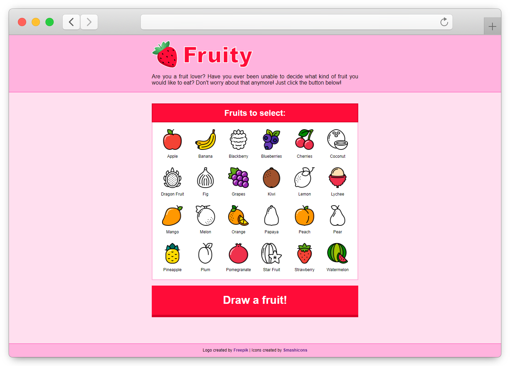

<!-- APPLICATION PREVIEW -->
<div align="center">
  
  
  
</div>

<!-- SHIELDS -->
<div align="center">
  
  
  
  [](https://github.com/lszymanski7/fruity-app/blob/main/LICENSE.md)
  
  
  
  
  
</div>

<br/>

<!-- FRUITY -->
# Fruity
Are you a fruit lover? Have you ever been unable to decide what kind of fruit you would like to eat? Don't worry about it anymore! All you have to do is select your favorite fruits, click the button and let the application decide for you. It's so simple!

🚀 **Live demo:** <a href="https://lszymanski7-fruity.netlify.app">https://lszymanski7-fruity.netlify.app<a/>

<!-- TABLE OF CONTENTS -->
## Table of Contents
1. [Features](#features)
2. [Technologies](#technologies)
3. [Getting Started](#getting-started)
    - [Prerequisites](#prerequisites)
    - [Installation](#installation)
    - [Application](#application)
4. [Contributing](#contributing)
5. [Attribution](#attribution)
6. [License](#license)

<!-- FEATURES -->
## Features
- Selecting fruits that should be included in the draw.
- Resetting selected fruits to default state.
- Drawing a fruit from among the selected ones.
- Saving data to localStorage.
- Toggling between light and dark theme.

<!-- TECHNOLOGIES -->
## Technologies


[](https://sass-lang.com)
[](https://reactjs.org)
[](https://webpack.js.org)
[](https://babeljs.io)
[](https://jestjs.io)
[](https://testing-library.com)
[](https://nodejs.org/en)
[](https://npmjs.com)
[](https://expressjs.com)
[](https://eslint.org)
[](https://prettier.io)

All technologies and tools were used in the latest version at the time of creating this project.

<!-- Getting Started -->
## Getting Started

<!-- Prerequisites -->
### Prerequisites
> **Note** Download [Node.js](https://nodejs.org/en/download) installer.

This project was created with the Node.js (v18.9.0) runtime environment and the NPM (v8.19.1) for package management. Use the Node.js installer to install both of them on your system.

<!-- Installation -->
### Installation
Follow all of the steps below to get a local copy of the project and install any dependencies required to run it.

1. Clone the repository.

```
$ git clone https://github.com/lszymanski7/fruity-app.git
```

2. Navigate to the project directory.

```
$ cd fruity-app
```

3. Install all dependencies.

```
$ npm install
```

<!-- APPLICATION -->
### Application
To run the application, you must first create a production build. Use the command below for this purpose.

```
$ npm run build
```

The next command starts the server built with Node.js and Express. All static files generated by webpack will be served from the `./build` folder. The application will be launched at the following url: [http://localhost:3000](http://localhost:3000)

```
$ npm run start
```

<!-- CONTRIBUTING -->
## Contributing
Any contributions are greatly appreciated. Use the [issue tracker](https://github.com/lszymanski7/fruity-app/issues) if you want to report bugs, request a new feature or improve documentation. Please check for existing issues before you report them yourself.

You can contribute by following these steps:
1. Fork this repository on GitHub.
2. Clone the forked repository to your machine: `$ git clone https://github.com/username/fruity-app.git`
3. Create a new branch: `$ git switch -c <branch-name>`
4. Make necessary changes and commit them.
5. Push changes to GitHub: `$ git push origin -u <branch-name>`
6. Submit a new Pull Request on GitHub.

<!-- ATTRIBUTION -->
## Attribution
- Logo created by <a href="https://flaticon.com/authors/freepik">Freepik</a> from <a href="https://flaticon.com">www.flaticon.com</a>
- Icons created by <a href="https://flaticon.com/authors/smashicons">Smashicons</a> from <a href="https://flaticon.com">www.flaticon.com</a>

<!-- LICENSE -->
## License
This project is licensed under the terms of the [MIT License](https://github.com/lszymanski7/fruity-app/blob/main/LICENSE.md).

<br/>

<!-- LINKS -->
##
<div align="center">
  <p>If you have any questions or suggestions, please send me an <a href="mailto:lszymanski.info@gmail.com?subject=GitHub - Your subject here...">e-mail</a>. <br/> You can also find me on the following websites:</p>
  
  [](https://gitlab.com/lszymanski7)
  [](https://linkedin.com/in/lszymanski7)
</div>
