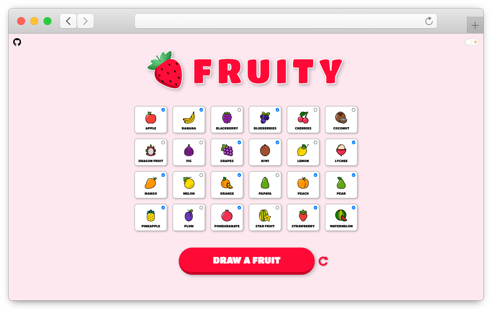

<!-- APPLICATION PREVIEW -->
<div align="center">
  
  
  
</div>

<!-- SHIELDS -->
<div align="center">
  
  
  
  [](https://opensource.org/licenses/MIT)
  
  
  
  
  
</div>

<br/>

<!-- FRUITY -->
# Fruity
Are you a fruit lover? Have you ever been unable to decide what kind of fruit you would like to eat? You don't have to worry about it anymore. This application will help you make this difficult decision with just one click.

Live demo: <a href="https://lszymanski7-fruity.herokuapp.com">https://lszymanski7-fruity.herokuapp.com<a/>

<!-- TABLE OF CONTENTS -->
## Table of contents
1. [Features](#features)
2. [Technologies](#technologies)
3. [Installation](#installation)
4. [Scripts](#scripts)
5. [Bugs and Features](#bugs-and-features)
6. [Attribution](#attribution)
7. [License](#license)

<!-- FEATURES -->
## Features
- Possibility to filter the fruit list. Selecting fruits that should not be included in the draw. 
- Drawing a fruit from the filtered list of objects. At least two fruits must be selected to start the draw.
- Saving data in Local Storage.

<!-- TECHNOLOGIES -->
## Technologies
This project was created using the following technologies and tools:


[](https://reactjs.org)
[](https://sass-lang.com)
[](https://webpack.js.org)
[](https://babeljs.io)
[](https://testing-library.com)
[](https://jestjs.io)
[](https://nodejs.org/en)
[](https://npmjs.com)
[](https://expressjs.com)
[](https://eslint.org)
[](https://prettier.io)

<!-- INSTALLATION -->
## Installation
Follow all of the steps below to get a local copy of the project and be able to run it.

1. Clone the repository.
```
git clone https://github.com/lszymanski7/fruity-app.git
```
2. Navigate to the project directory.
```
cd fruity-app
```
3. Install all dependencies.
```
npm install
```
4. Run Express server.
```
npm run start
```

The project will be launched at the following url: <a href="http://localhost:3000">http://localhost:3000<a/>
  
<!-- SCRIPTS -->
## Scripts
```
npm run build:dev
```

```
npm run build:prod
```

```
npm run dev-server
```

```
npm run eslint:check
```

```
npm run eslint:fix
```

```
npm run heroku-postbuild
```

```
npm run prettier:check
```

```
npm run prettier:fix
```

```
npm run start
```

```
npm run test
```

```
npm run test:watch
```
  
<!-- BUGS AND FEATURES -->
## Bugs and Features  
> You can report bugs and request new features [here](https://github.com/lszymanski7/fruity-app/issues). 
  
Please search the existing bugs and feature requests before you file one yourself.
  
<!-- ATTRIBUTION -->
## Attribution
- Logo created by <a href="https://flaticon.com/authors/freepik">Freepik</a> from <a href="https://flaticon.com">www.flaticon.com</a>
- Icons created by <a href="https://flaticon.com/authors/smashicons">Smashicons</a> from <a href="https://flaticon.com">www.flaticon.com</a>
  
<!-- LICENSE -->
## License
> You can check out the full license [here](https://github.com/lszymanski7/fruity-app/blob/main/LICENSE.md).
  
This project is licensed under the terms of the **MIT** license.
  
<br/>
 
<!-- LINKS -->
##
<div align="center">
  <p>Connect with me:</p>
  
  [](https://stackoverflow.com/users/18706083)
  [](https://gitlab.com/lszymanski7)
  [](https://linkedin.com/in/lszymanski7)
  [](https://twitter.com/lszymanski7_)
  
</div>
